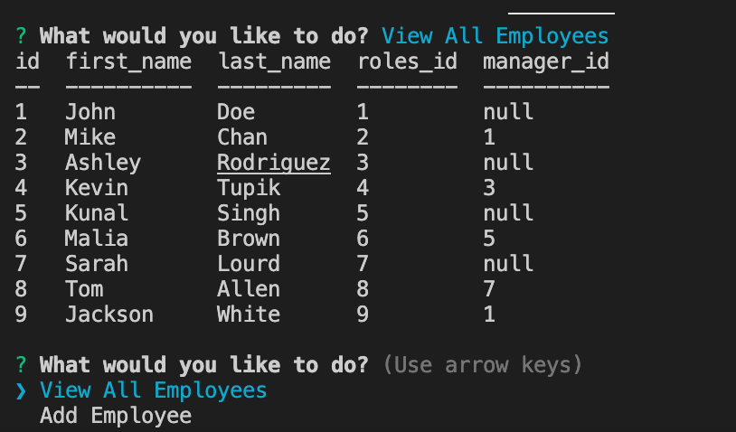

# Employee Tracker

## Employee Tracker Description

This application is designed to assist business owners in keeping track of employee data through the use of MySQL2 and the terminal. By keeping track of departments, roles, and employees, business managers can optimize their human resources. Recommended application to use is VSCode. Future development will prioritize a more friendly UI/UX.

## Using application

To use this application, refer to this video: https://watch.screencastify.com/v/VS6tvtsvnzenSWKbNtNO

## Installing application

To install this application, either clone this repository or download directly through a zip file. Ensure you're running it on VS-Code. Make sure to use npm to install all necessary packages (mysql2, sequelize, dotenv). Start through using the "npm start" command.